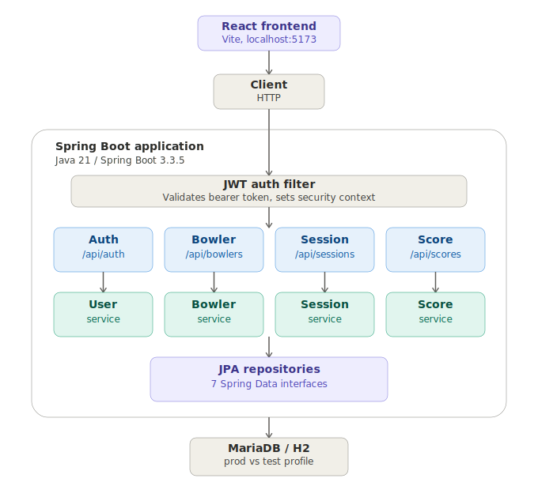

# Overview
A REST backend (Java 21 / Spring Boot, JWT auth) that lets a group log bowling sessions, enter frame-by-frame scores per bowler per game, and compute win/loss points and a session leaderboard.

# Architecture

```
React frontend (Vite, localhost:5173)
   |
   v
Client (HTTP)
   |
   v
JWT auth filter                       (validates bearer token, sets security context)
   |
   v
Controllers   Auth        Bowler        Session        Score        (/api/auth, /api/bowlers, /api/sessions, /api/scores)
   |             |           |             |              |
   v             v           v             v              v
Services      User        Bowler        Session         Score        (business logic, see Entities/Scoring below)
   |             |           |             |              |
   +-------------+-----------+-------------+--------------+
                              |
                              v
                  JPA repositories (7 Spring Data interfaces)
                              |
                              v
                      MariaDB (dev/prod) / H2 (test profile)
```
Each controller delegates to its matching service (`AuthController` calls `UserService`), which reads/writes through the repositories in [Entities](entities/index.md). See [Tech Stack](tech_stack.md) for exact versions of every layer.

# Concepts
- [Entities](entities/index.md) — JPA data model
- [API](api/index.md) — REST endpoints
- [Scoring](metrics/scoring.md) — frame score and game points calculation
- [Frontend](frontend.md) — React + Vite + TypeScript app that consumes the API
- [Tech Stack](tech_stack.md) — languages, frameworks, libraries, and versions

# All documents
**Entities**
- [User](entities/user.md) — login account
- [Role](entities/role.md) — authorization role (ADMIN, USER)
- [Bowler](entities/bowler.md) — a player, optionally linked to a User
- [BowlingSession](entities/session.md) — a date/location grouping of games
- [Game](entities/game.md) — one game within a session
- [BowlerGame](entities/bowler_game.md) — a bowler's participation/result in a game
- [Frame](entities/frame.md) — one of the 10 frames within a BowlerGame

**API**
- [Auth](api/auth.md) — `/api/auth/*` login, register, refresh, current user
- [Bowlers](api/bowlers.md) — `/api/bowlers/*` CRUD
- [Sessions](api/sessions.md) — `/api/sessions/*` sessions and their games
- [Scores](api/scores.md) — `/api/scores/*` frame entry and leaderboard

**Other**
- [Scoring](metrics/scoring.md) — frame score and game points calculation
- [Frontend](frontend.md) — React + Vite + TypeScript app that consumes the API
- [Tech Stack](tech_stack.md) — languages, frameworks, libraries, and versions
